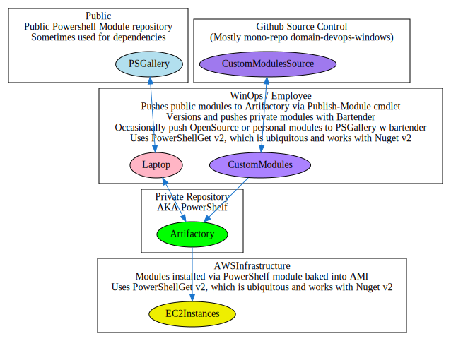

# How PowerShell Modules are used at Domain

Powershell modules are managed using a NUGET based repository. PowerShell comes with a module that manages modules called PowerShellGet. However PowerShellGet is written for Nuget v2. Nuget v3 is supported in the work-in-progress PowerShellGet version 3, but this is still very much feature incomplete and in Beta.

## All about PowerShell and Nuget

Even though the underlying package specification and API is NUGET, the implementation is completely different from DotNets package management solution, so any learnings from DotNet teams may not be directly applicable to PowerShell modules.

When dealing with a Nuget V2 repository specifically provisioned for PowerShell, everything in the package management space works sufficiently and easily enough that no expert knowledge of nuget or powershell is required. Users only need to know a few functions for managing their modules, namely

`find-module` , `install-module`, `update-module` , and `import-module` are required for basic functionality.

For creating modules a fair bit more knowledge is required, including detailed knowledge on how module manifests work and how to create them, as well as a basic understanding of Nuget so that how the `publish-module` function works under the hood makes sense.

We have a nuget Artifactory repository called PowerShelf. Since we are moving away from Artifactory, we need a replacement. The future looks like Github Packages, but as things are today, the transition is not smooth

## How is this used today

### Key points

 - Winops Engineer makes a new BarTender module
 - Installs any dependent modules locally from  public PSGallery, then pushes to Artifactory
 - Compiles and versions module on laptop, pushes to Artifactory
 - Installs the module from Artifactory for local use
 - Modules are also available via PowerShelf cmdlets baked into AMI
 - Any modules required by EC2 instances from PSGallery are also copied to artifactory to ensure version stability
 - Compiling modules does not work on Linux/Mac (Needs windows)
 - Pester (Unit testing) is currently broken
 - Was waiting on PowerShellGet v3 to exit BETA prior to fixing these things but it's been 2 years now and we are out of time

### What Modules are in Artifactory

 - DomainDSC + DomainDSCINit
    - These modules are used by all new instances
    - Rather than have complex user-data launch scripts, it will execute functions in these modules
 - Tools and Dependency Modules
    - Includes AWS Tools; Akamai Tools; Scheduled Task Helpers
    - Sometimes we have a dependency on a public module, to follow best practice we often publish a tested version of the module to our own repository in order to maintain availability and mitigate supply-chain attacks
    

### Flow Chart

The below flowchart loosley shows how PowerShell modules work currently.

## How should we be making modules in the future

### Key Points

 - Artifactory is going away, Github Packages should be the future
 - Need to move to PowerShellGet v3 Beta to accomodate above since Github Packages only supports Nuget V3
 - Should also move to Github Actions to build modules to remove windows dependency, and follow DevOps Practices
 - Require move away from MonoRepo to 1 repo per module
 - Also need to solve for Public Modules and Dependencies and avoid exposure to SupplyChain concerns. This is much harder to do in Github Packages

### The list of concerns with getting over the line

 - PowerShellGet v3 is in BETA. Expect the unexpected
     - I have had a few problems with the new PowerShellGet that will need to be worked around at least temporarily
     - All of the function names are now different. For example `find-module` is now `find-psresource`, `install-module` is now `install-psresource`. This means that we are basically starting from scratch with PowerShellGet v3
 - Github Packages NUSPEC requires repository URI. 
   - This means that there is no straight-forward way to upload a package to github.
    - Effectively need to create a nupkg, unpack it, edit the nuspec xml with the repository uri, repack it, then send it up the pipe
    - This also causes concerns with dependencies. Should we be putting 3rd party packages into Github Packages at all? How do we automate the unpack, edit, repack, push?
    - This means we cannot use the PowerShellGet cmdlets to push the package, instead we need to use DotNet Nuget Push with a packed nupkg
 - The Find-Module function in PowerShellGet does not work with the Nuget API in Github Packages for wildcard or partial searches. It works only with the full and specific package name. This means that find-module is extremely limited and we will need to find a replacement.
    - This is due to a Nuget V3 _only_ implementation where the find-package cmdlet only support Nuget V2. Some V3 implementations do supply backwards compatibility but this is not the case with Github
- There is much to do with the creation/publishing of modules
- We need to replace the PowerShelf functions (i.e. install-powershelfmodule) on ALL our EC2 instances once we migrate the packages
    - This will most easily be done with creating new AMIs, testing, then cycling all instances to the new AMI
    - There is a fallback for the older AMIs in that we bake the build modules into the AMI to ensure availability in the event of Artifactory being unavailable.
- it is likely that whatever we do to work around the deficiencies of PowerShellGet v3 beta, a newer version of PowerShellGet will include out of the box. I have no ETA on the timelines of this though

### Flow Chart

I think what we want is something like the below. The Red arrows identify completely untested sections that need to be coded for or tested

