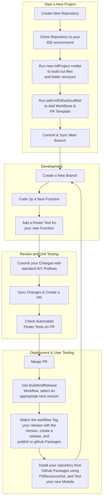

# ModuleForge

ModuleForge is a scaffolding and build tool designed to streamline PowerShell module creation. It simplifies the process of setting up a module, automating versioning, and ensuring compatibility with modern CI/CD workflows with a minimal amount of effort.

## Objectives of this module

What I wanted to achieve with this tool was the following:

- PowerShell CI/CD with a minimal amount of config
- Standardised, fast module setup
- Cross-platform, OS agnostic
- Semantic Versioning with easy prerelease support and incrementing
- Maximum compatibility, little effort implementation with any orchestration tool, including Github Actions and Azure DevOps
- Support and use the latest versions of PowerShell 7+, Pester, and PSResourceGet
- Compatibility for GitHub Packages
- Support simple and complex PowerShell modules alike
- Easily identify function and file dependencies in your project

ModuleForge is designed for flexibility. Whether you prefer GitHub Actions, PSake, PSBuild, or a fully custom pipeline, this module should integrate without forcing you to change your approach

## Dependencies

ModuleForge requires Pester v5+ and PSResourceGet. If needed, update them using the following commands:

```PowerShell
install-module -name pester -repository psgallery -force

install-module -name Microsoft.PowerShell.PSResourceGet -force
```

## Getting Started

Install ModuleForge from the PSGallery

```PowerShell
install-psresource -name moduleforge -repository PSGallery
```

Create a ModuleForge Project:

```PowerShell
#Create a clean working directory
New-item -itemType Directory -name 'moduleForgeTest'
set-location 'moduleForgeTest'

#Create your new project
new-mfProject -ModuleName 'Test' -description 'A test module'

#Start adding functions 
```

## Next Steps: Documentation and Tutorials

Tutorials, function documentation, examples, and other information is published [here](https://adrian-andersson.github.io/ModuleForge/)

## Key Features

- Single command to get a standard file-structure up to start coding
- Automate change-log from commit messages
- Document and discover file and function dependencies
- Support for advanced PowerShell features, such as enumerators and classes
- Functions to assist with version incrementation
- Module compilation functions to help build a functional release package
- GitHub Workflow examples and bootstrap provided to use Tags and automate pester test and provide an intuitive build-and-release mechanism


## Example ModuleForge / Github Workflow


