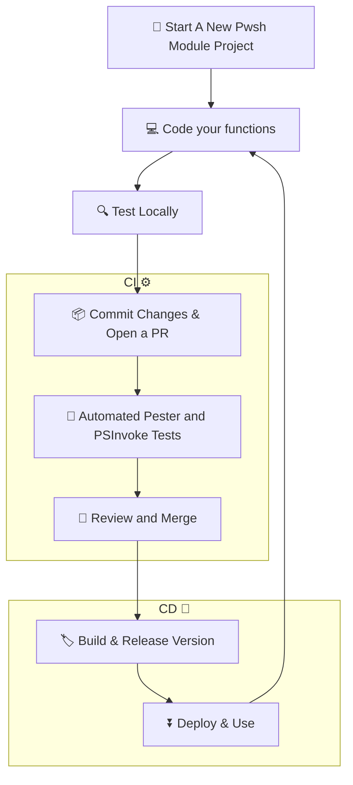

# ModuleForge

[](https://github.com/PowerShell/PowerShell)
[](https://adrian-andersson.github.io/ModuleForge/)
[](https://github.com/features/actions)
[](https://azure.microsoft.com/en-us/products/devops)
[](https://www.powershellgallery.com/packages/ModuleForge)

> **From a blank slate to a production-ready PowerShell module -> with CI/CD, versioning, release notes and publishing sorted, up and running in minutes**

**ModuleForge** is a scaffolding and build tool that takes the grunt work out of PowerShell module development. Stop copy-pasting boilerplate, wrestling with versioning, or hand-rolling CI pipelines. ModuleForge handles the infrastructure so you can focus on writing great code.

📦 **[Install from PowerShell Gallery](https://www.powershellgallery.com/packages/ModuleForge)**  
📖 **[Read the Full Documentation](https://adrian-andersson.github.io/ModuleForge/)**

```powershell
Install-PSResource -Name ModuleForge
```

## Why ModuleForge?

Setting up a PowerShell module correctly is tedious. Consistent folder structure, semantic versioning, changelog automation, CI/CD pipelines for both GitHub and Azure DevOps, Pester integration, PSResourceGet compatibility: There is a lot to know, a lot to get right, and even more to maintain across projects.

ModuleForge solves this with a single, opinionated CI/CD toolchain that gets out of your way once you're up and running.

## Key Features

### 🏗️ One-Line Module Scaffolding

Spin up a standardised, ready-to-build module structure in seconds. No more blank-page paralysis or inconsistent project layouts across your team.

### ⚙️ CI/CD Workflows — GitHub & Azure DevOps

Add production-grade pipelines with full feature parity across both platforms:

- **Pester tests** are hard-fail — broken code doesn't ship
- **Code coverage** is soft-fail — tracked without blocking releases
- **PSScriptAnalyzer** runs in advisory mode — keeping your code clean without the noise
- **Auto-generated PR comments** surface lint and test results directly in your review workflow


### 🏷️ Tag-Based Semantic Versioning

Auto-Applied tagging tracks build versions so you don't have to, including pre-release support for staging and beta builds.


### 📋 Automated Changelog Generation

Commit prefixes (`feat:`, `fix:`, `chore:`, etc.) drive automatic changelog creation and GitHub Packages release notes — no manual changelog maintenance required.


### 📦 Flexible Publishing

Publish to **GitHub Packages** or **Azure DevOps Artifacts** feeds for personal projects or testing, and one-click publish to PSGallery when your ready.
Options for whatever fits your workflow and requirements

### 🛠️ Full PowerShell 7+ Support

Built for modern PowerShell — including enumerators, classes, and advanced language constructs. Uses the latest versions of **Pester** and **PSResourceGet**.

Advanced modules including classes and enumerators, it's your project, your choice what to code

## Workflow Overview



## Design Goals

ModuleForge was built around a clear set of principles:

| Goal | What It Means |
|---|---|
| **Minimal config** | PowerShell CI/CD that just works |
| **Standardised setup** | Fast, consistent module scaffolding every time |
| **Cross-platform** | Fully OS agnostic; Windows, macOS, Linux |
| **Semantic versioning** | Easy pre-release support and version incrementing |
| **Orchestrator agnostic** | Works with GitHub Actions, Azure DevOps, or your own tooling |
| **Modern stack** | PowerShell 7+, Pester, and PSResourceGet |
| **Scalable** | Handles simple scripts and complex multi-dependency modules alike |

## Getting Started

Full tutorials, function reference, and examples are available in the **[ModuleForge documentation](https://adrian-andersson.github.io/ModuleForge/)**.

---

## Contributing

Issues and PRs welcome. Please review the documentation before submitting.
