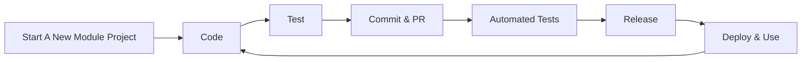

# ModuleForge

ModuleForge is a scaffolding and build tool designed to streamline PowerShell module creation. It simplifies the process of setting up a module, automating versioning, and ensuring compatibility with modern CI/CD workflows with a minimal amount of effort.

## Full Documentation Available Here

Tutorials, function documentation, examples, and other information is published [here](https://adrian-andersson.github.io/ModuleForge/)

## Design Goals

ModuleForge was built to achieve the following goals

- PowerShell CI/CD with minimal config
- Standardised, fast module setup
- Cross-platform, OS agnostic
- Semantic Versioning with easy prerelease support and incrementing
- Orchestration tool agnostic
- Support and use the latest versions of PowerShell 7+, Pester, and PSResourceGet
- Compatible with GitHub Packages
- Support simple and complex PowerShell modules alike
- Easily identify function and file dependencies in your project

ModuleForge is designed for flexibility.

## Key Features

- One-line module scaffolding with standard file layout
- Add CI workflows for GitHub or Azure DevOps (Feature Parity)
  - Pester tests are hard-fail, code coverage is soft-fail, ScriptAnalyzer is advisory
  - PR comments auto-generated with lint/test results
  - 
- Semantic changelog automation from commit prefixes (`feat`, `fix`, etc.)
  - GitHub Packages release integration
  - 
- Support for enumerators, classes, and advanced PowerShell constructs
- Tag-based automated versioning with pre-release support
  - 
- Works with GitHub Packages and Azure DevOps feeds for module repositories

## Workflow Overview

