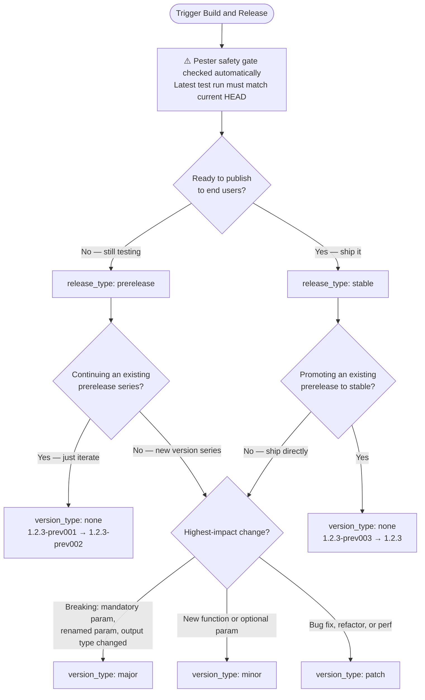

# Build and Release Guide

The **Build and Release** workflow is triggered manually from GitHub Actions (`Actions → Build and Release → Run workflow`). It versions, builds, and publishes your module to your Artifacts feed — and optionally creates a stable GitHub Release.

This guide helps you choose the right inputs every time.

---

## Before You Trigger

The workflow checks a safety gate before it does anything else: the most recent Pester test run must have passed **and** its commit SHA must match the current HEAD on `main`. If your last Pester run was against an older commit, or if tests are failing, the workflow exits immediately.

> Merge your PR, confirm the automatic Pester run passed, then trigger Build and Release.

---

## The Two Inputs

### `release_type` — Are you testing or shipping?

| Value | When to use |
| --- | --- |
| `prerelease` | Changes are not yet ready for end users — still validating |
| `stable` | Changes are validated and ready to publish as the official version |

Prereleases are published to your Artifacts feed but are hidden from `Find-PSResource` / `Find-Module` unless `-AllowPrerelease` is explicitly passed. Use them to validate across environments before committing to a stable version.

### `version_type` — What changed?

| Value | What it does | Driven by |
| --- | --- | --- |
| `none` | Keeps current `MAJOR.MINOR.PATCH`, increments prerelease counter only | Iterating on an existing prerelease, or promoting a prerelease to stable |
| `patch` | Increments `PATCH` (`1.2.3 → 1.2.4`) | Bug fixes, refactors, performance changes — no API change |
| `minor` | Increments `MINOR`, resets `PATCH` (`1.2.3 → 1.3.0`) | New functions or optional parameters — backwards compatible |
| `major` | Increments `MAJOR`, resets `MINOR` and `PATCH` (`1.2.3 → 2.0.0`) | Breaking changes — existing scripts may need updating |

> Use the **highest-impact** change since your last tag. If you added a new function (`minor`) and fixed a bug (`patch`) in the same PR set, choose `minor`.

---

## Decision Flowchart



---

## Combination Reference

| version_type | release_type | Example result | Typical scenario |
| --- | --- | --- | --- |
| `none` | `prerelease` | `1.2.3-prev001 → prev002` | Iterating on a prerelease — fix a bug and rebuild |
| `none` | `stable` | `1.2.3-prev003 → 1.2.3` | Promoting a validated prerelease to stable |
| `patch` | `prerelease` | `1.2.3 → 1.2.4-prev001` | Start testing a bug fix |
| `patch` | `stable` | `1.2.3 → 1.2.4` | Ship a bug fix directly |
| `minor` | `prerelease` | `1.2.3 → 1.3.0-prev001` | Start testing a new function |
| `minor` | `stable` | `1.2.3 → 1.3.0` | Ship a new function directly |
| `major` | `prerelease` | `1.2.3 → 2.0.0-prev001` | Start testing a breaking change |
| `major` | `stable` | `1.2.3 → 2.0.0` | Ship a breaking change |

---

## Common Scenarios

### "This is my first release"

Starting fresh on a brand new module — no tags exist yet.

```
version_type: none
release_type: prerelease
```

Result: `0.0.1-prev001` (or whichever starting version is configured). Lets you validate the build pipeline before shipping anything.

---

### "I merged a bug fix PR and want to test it"

```
version_type: patch
release_type: prerelease
```

Result: e.g. `1.2.3 → 1.2.4-prev001`. The module is published to your feed but marked as prerelease.

---

### "I've tested the prerelease and it's good — ship it"

```
version_type: none
release_type: stable
```

Result: e.g. `1.2.4-prev002 → 1.2.4`. Promotes the prerelease to stable and creates a GitHub Release with the changelog.

---

### "I have several bug fixes ready — skipping prerelease"

Only skip prerelease validation if you have high confidence (e.g. the change is trivial or well-covered by tests).

```
version_type: patch
release_type: stable
```

Result: e.g. `1.2.3 → 1.2.4` directly.

---

### "I added two new functions and validated them in prerelease"

```
version_type: none
release_type: stable
```

The prerelease was already built with `minor` — so the version is already `1.3.0-prevXXX`. Promoting it with `none + stable` gives `1.3.0`.

---

## What Happens After a Stable Release

When `release_type: stable`, the workflow:

1. Tags the commit with `v{version}` (e.g. `v1.3.0`)
2. Publishes the module package to your GitHub Packages feed
3. Creates a GitHub Release with changelog entries generated from commit prefixes
4. The release appears on the **Code** tab with the `Latest` badge

Prerelease builds are also published to GitHub Packages but create a pre-release GitHub Release (marked as pre-release, no `Latest` badge).

---

## Prerelease Version Format

ModuleForge uses zero-padded three-digit counters to ensure correct lexicographic ordering:

```
1.3.0-prev001
1.3.0-prev002
...
1.3.0-prev010   ← sorts correctly after prev009
```

The label `prev` is lowercase by design — there is a known PSResourceGet bug where uppercase prerelease labels cause incorrect behaviour on some feeds.

See [Module Versioning with SemVer](./Concepts/ModuleVersioning_With_SemVer.md) for the full explanation of the versioning rules and PSGallery constraints.

---

## Related

- [Commit Prefixes](./commit-prefixes.md) — which prefixes map to which changelog sections and version types
- [Commit Strategy and PR Process](./Concepts/CommitStrategy_And_PRProcess.md) — how the PR template connects to version decisions
- [Module Versioning with SemVer](./Concepts/ModuleVersioning_With_SemVer.md) — detailed SemVer rules and PSGallery constraints
