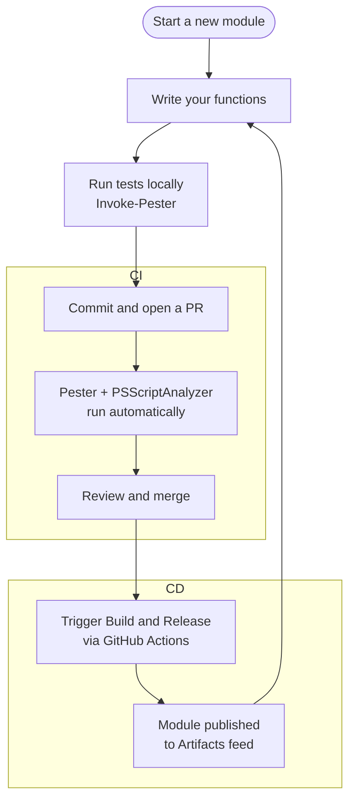

# Getting Started with ModuleForge

ModuleForge scaffolds a production-ready PowerShell module structure — including CI/CD pipelines, Pester test stubs, and semantic versioning — so you can focus on writing functions rather than plumbing.

---

## Prerequisites

### Local tools

| Requirement | Minimum Version |
| --- | --- |
| PowerShell | 7.0+ |
| Git | Any recent version |
| Pester | 5.6+ |
| PSScriptAnalyzer | 1.24+ |
| Microsoft.PowerShell.PSResourceGet | 1.1.1+ |

A terminal and any text editor will do, but VSCode is assumed in the step-by-step tutorials.

### Platform account (pick one)

| Platform | What you need |
| --- | --- |
| **GitHub** | A GitHub account and a repository (public or private) |
| **Azure DevOps** | An Azure DevOps organisation and project, with an Artifacts feed and build service permissions configured — see [Azure DevOps Prerequisites](./tutorials/azureDevOps/azureDevOps-preRequisites.md) |

> **Runner / agent setup**
>
> **GitHub Actions** — the scaffolded workflows use `ubuntu-latest` (GitHub-hosted runners). No setup is required for most cases. If you need Windows-specific behaviour or a private network, configure a [self-hosted runner](https://docs.github.com/en/actions/hosting-your-own-runners/managing-self-hosted-runners/about-self-hosted-runners) and update the `runs-on:` value in the generated workflow files.
>
> **Azure DevOps** — the scaffolded pipelines also target `ubuntu-latest`. If your organisation does not have Microsoft-hosted agents enabled, or you need a specific environment, you will need to provision a [self-hosted agent](https://learn.microsoft.com/en-us/azure/devops/pipelines/agents/agents) and update the `pool:` in the generated pipeline YAML.

---

## Install ModuleForge

```powershell
# Bootstrap PSResourceGet first if you don't have it
Install-Module Microsoft.PowerShell.PSResourceGet -Force

# Install everything you need
Install-PSResource -Name Pester, PSScriptAnalyzer, ModuleForge
```

---

## Scaffold a New Module

From your (already-initialised) git repository root:

```powershell
# Create the folder structure and build config
New-MFProject -ModuleName 'MyModule' -Description 'What my module does'
```

Then add CI/CD workflows for your platform:

**GitHub Actions**
```powershell
Add-MFGithubScaffold
```

**Azure DevOps**
```powershell
Add-MFAzureDevOpsScaffold
```

Commit the scaffolding back to `main` before doing anything else — the CI workflows need to exist on the default branch before they can run.

```
chore: initialise ModuleForge project with scaffolding and workflows
```

---

## What Gets Created

```
MyModule/
├── source/
│   ├── functions/          ← exported functions (.ps1 + .Tests.ps1)
│   ├── private/            ← internal helpers (not exported)
│   ├── classes/            ← PowerShell classes
│   ├── enums/              ← enum definitions
│   ├── validationClasses/  ← custom [ValidateScript] types
│   └── resource/           ← non-code files bundled with the module
├── moduleForgeConfig.xml   ← build and publish configuration
└── .github/workflows/      ← CI/CD pipelines (GitHub) or azure-pipelines.yml
```

Each function gets its own file. Each function file gets its own `FunctionName.Tests.ps1` alongside it — Pester picks these up automatically.

---

## Development Workflow



The CI pipelines run automatically on every PR. The **Build and Release** step is triggered manually — you decide when a version is ready to ship and what kind of version bump it gets.

**PSScriptAnalyzer** runs on every PR as a soft gate — it reports findings but does not block a merge. The results are posted as a PR comment, grouped by severity: `Error`, `Warning`, and `Information`. Errors represent genuine problems (undefined variables, syntax issues); Warnings are style and best-practice concerns worth addressing; Information is advisory. The weighting is intentional — not everything flagged demands action, but the highest-severity items are surfaced first so you can prioritise. Treat the report as a code review prompt rather than a hard stop.

---

## Writing Your First Function

Add a `.ps1` file to `source/functions/` and a matching `.Tests.ps1` alongside it:

```powershell
# source/functions/Get-Greeting.ps1
function Get-Greeting {
    <#
        .SYNOPSIS
            Returns a greeting string.
        .EXAMPLE
            Get-Greeting -Name 'World'
    #>
    [CmdletBinding()]
    param(
        [string]$Name = 'World'
    )
    process {
        "Hello, $Name!"
    }
}
```

```powershell
# source/functions/Get-Greeting.Tests.ps1
BeforeAll {
    . $PSCommandPath.Replace('.Tests.ps1', '.ps1')
}

Describe 'Get-Greeting' {
    It 'returns the default greeting' {
        Get-Greeting | Should -Be 'Hello, World!'
    }
    It 'uses the provided name' {
        Get-Greeting -Name 'PowerShell' | Should -Be 'Hello, PowerShell!'
    }
}
```

**Always run tests locally before committing.** Two options:

Run a specific test file directly with Pester:

```powershell
Invoke-Pester .\source\functions\Get-Greeting.Tests.ps1
```

Or run the full test suite with code coverage — mirrors exactly what the CI pipeline does:

```powershell
Invoke-MFPester
```

`Invoke-MFPester` discovers all `*.Tests.ps1` files under `source/functions/`, runs them with code coverage enabled, and reports the results. Use this before opening a PR to confirm you're in the same state the automated pipeline will see.

Commit with the right prefix so your changelog generates correctly:

```
feat: add Get-Greeting function
test: add Pester tests for Get-Greeting
```

---

## Next Steps

| Goal | Where to go |
| --- | --- |
| Full walkthrough — GitHub setup | [GitHub Getting Started Tutorial](./tutorials/github/github-tutorial-01-getting-started.md) |
| Advanced features — enums, classes, private functions | [AstroCmdlets: An Advanced Tutorial](./tutorials/github/github-tutorial-02-full-ModuleForge-Featureset.md) |
| Azure DevOps setup | [Azure DevOps Tutorial](./tutorials/azureDevOps/azureDevOps-tutorial-01-getting-started.md) |
| Choosing version and release options | [Build and Release Guide](./build-and-release.md) |
| All commit prefixes and their effects | [Commit Prefixes](./commit-prefixes.md) |
| Full function reference | [Functions](./functions/) |
