# Getting Started with ModuleForge and Azure DevOps

This tutorial will demonstrate how to create a simple, single-function module using ModuleForge, with 1 pester test, and deploy via Azure DevOps Pipelines.

## Part 0 - Local Environment Setup

1. Make sure you have completed the [prerequisit](./azureDevOps-preRequisites.md)
2. Setup your local workspace. You will need to have installed
    - PowerShell 7+
    - VSCode (or your IDE of choice)
        - If you use an IDE other than VSCode, you will need to correct the instructions in this tutorial accordingly
    - GIT commandline
3. Install PowerShell module dependencies. You will need the following modules from the PSGallery:
    - `Pester` 5.6+
    - `PSScriptAnalyzer` 1.24+
    - `Microsoft.PowerShell.PSResourceGet` 1.1.1+
    - `ModuleForge` 1.2.0+

> Note: All the required modules are cross-platform compatible. Your OS of choice does not matter.

Here is a code-snippet to help get you started

```powershell
#Use the legacy PowerShell Get command to get PSResourceGet
Install-Module Microsoft.PowerShell.PSResourceGet

#Switch to PSResourceGet for the remainder
Install-PSResource -repository PSGallery -Name Pester,PSScriptAnalyzer,ModuleForge
```

## Part 1 - New Repository

1. Login to your Azure DevOps project
2. Select _Repos_ from the left menu, then use the small down arrow at the top to select `New Repo`
    - 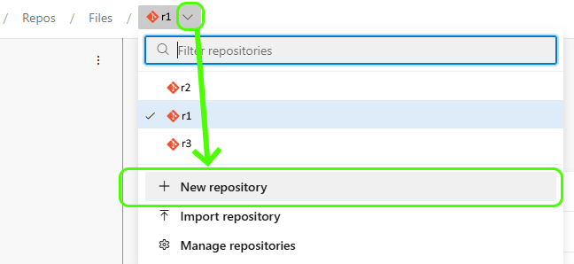
3. Fill in the Create a Repository menu
   - Your new repository should be called `PSHelloWorld`
   - You can leave the option for a readme selected
   - You can leave .gitignore set to _none_
4. Clone your repository to your local environment

> hint: If you are unsure of how to clone a repository, copy the URI from the browser address bar and use it with the `git clone` command, e.g. `git clone https://dev.azure.com/AzureDevOps-OrgName/AzureDevOps-ProjectName/_git/AzureDevOps-RepoName`

## Part 2 - Create a new ModuleForge Project

1. From your repository directory, run the `New-MFProject` function to build the files out, as per the example below
2. Check you have created a `source` directory and a module config file `moduleForgeConfig.xml`. The source directory should have a number of subfolders
3. Run the `Add-MFAzureDevOpsScaffold` function to add 3 Azure Pipeline YML files, and a PR template to the `.azuredevops` directory of your module folder
4. Check the files were created
5. With your filestructure created and workflows added, commit and sync your repository back to origin\main
   - You should use a proper commit message, something like `chore: Initialised ModuleForge project with scaffolding & workflows'

```powershell
New-MFProject -ModuleName 'psGetHelloWorld' -description 'Another Hello World module'
Add-MFAzureDevOpsScaffold
```

## Part 3 - Add our Azure Pipelines and Build Policies

>Note: The Pipeline setup and build policies steps need to be repeated for any new repositories

### Adding Azure Pipelines

1. Open Azure Devops in your browser and select _Pipelines_
2. Select `New Pipeline` in the top right of the Pipelines window.
3. In the _connect_ tab, select `Azure Repos Git` as the option for _where is your code_
    - 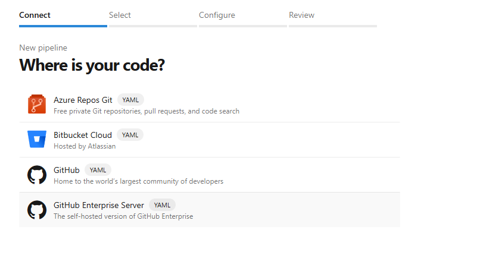
4. Select the correct repository `PSHelloWorld`
5. In the _Configure your Pipeline_ screen, select `Existing Azure Pipeline YAML file`
    - 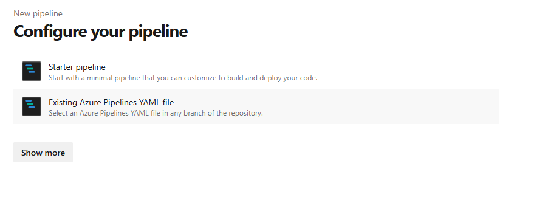
6. Select the `psScriptAnalyzerLintReport.yml` file
    - 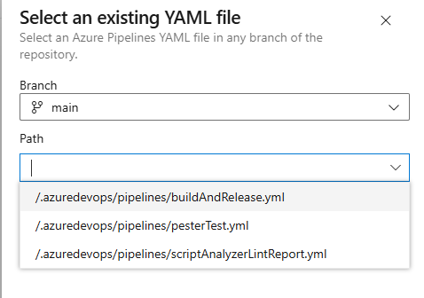
7. In the _Review your Pipeline_ screen, use the small arrow next to _RUN_ and select `SAVE`
8. In the next screen, select the small _three dot_ menu in the top-right, and select `Rename/Move`
    - 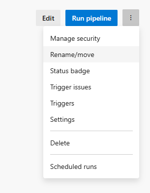
9. Change the name and folder of the pipeline
    - The Name of the pipeline should be renamed to `psScriptAnalyzerLintReport` to better identify it later
    - The `Select Folder` should be named after the repository - `PSGetHelloWorld`
    - This organisational step is critical to ensure that your Pipelines are well organised and identifiable later
    - 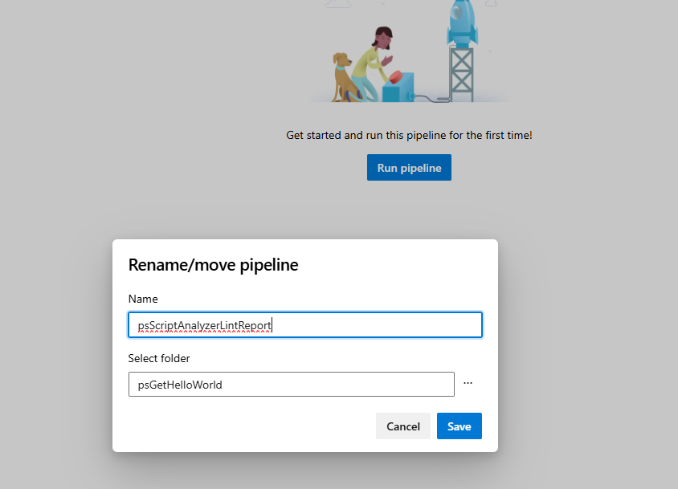
10. Repeat steps 2 through to 9 for `buildAndRelease` and `pesterTesting`
    - 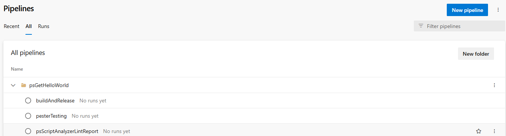

### Adding Branch Build Policies

1. Go to your newly created Repo and select _Branches_ option
2. At the far right, when hovering over the _main_ branch item, there will be a `More Options` menu. Open it, and select `💡Branch policies`
3. Under Build Validation, add a new item
    - Point to the `psScriptAnalyzer` pipeline we made in the previous section
    - Trigger should be `Automatic`
    - Policy should be `Optional`
    - Expiry can be left at default
    - Change the displayname to `Script Analyzer Report` for easier visualisation
4. Under Build Validation, add a second new item
    - Point to the `Pester Testing` pipeline we made in the previous section
    - Trigger should be `Automatic`
    - Policy should be `Required`
    - Expiry can be left at default
    - Change the displayname to `Pester` for easier visualisation
5. You should now have 2 Build Validation steps, 1 _Optional_ Script Analyzer step, and 1 _Required_ Pester step

- 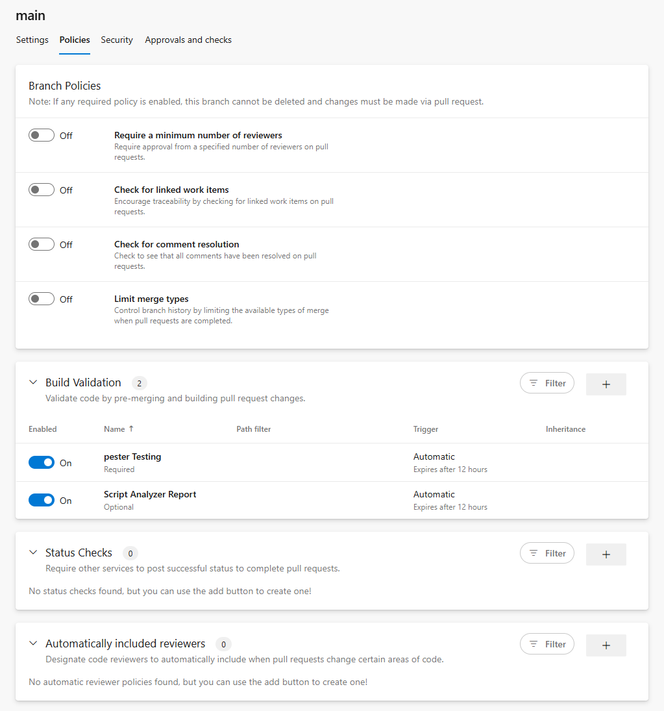

## Part 4 - Create a Function and a Test

> If we did all the previous steps correctly, we should not need to do any more settings configurations for this repository.

### Creating our get-helloWorld function

1. Return to VSCode (or other IDE)
2. Create a branch called `feature/hello-world-function`. 
    - You can deviate from this naming convention if you like. The objective is to be consistant.
3. Create a new file in the `functions` sub-directory of the `source` directory
   - Call the file `Get-HelloWorld.ps1`
4. Code up your powershell function code.
   - An example is provided below
   - Make sure you include some form of Inline Help and follow good coding practices

> Hint: In VSCode you can create a branch by clicking on the current branch name in the bottom left corner, then in the dialog box, selecting `+Create New Branch`. VSCode will automatically switch you to the new branch

```powershell
function Get-HelloWorld
{

    <#
        .SYNOPSIS
            Return Hello World
            
        .DESCRIPTION
            Return Hello World. Allows you to overwrite the default name of world with 
            
        .EXAMPLE
            Get-HelloWorld
            
            #### OUTPUT
            Returns "Hello World!"

        .EXAMPLE
            Get-HelloWorld -name 'James'
            
            #### OUTPUT
            Returns "Hello James!"
    #>

    [CmdletBinding()]
    PARAM(
        #Name param, specify to override the default of World
        [Parameter()]
        [string]$Name = 'World'
    )
    begin{
        #Return the script name when running verbose, makes it tidier
        write-verbose "===========Executing $($MyInvocation.InvocationName)==========="
        #Return the sent variables when running debug
        Write-Debug "BoundParams: $($MyInvocation.BoundParameters|Out-String)"
        
    }
    
    process{
        "Hello $Name!"
    }
    
}

```

### Creating our Pester Test

1. Create a new file in the `functions` sub-directory of the `source` directory
   - Call the file `Get-HelloWorld.Tests.ps1`
   - It is important that `Tests` is in the correct, capital-case format for `invoke-pester` to work.
2. Code up your Pester Test. You can use the example below
   - Don't forget to load your functions file in a before all block
   - This can be achieved dynamically with this little piece of code: `. $PSCommandPath.Replace('.Tests.ps1','.ps1')`

```powershell
BeforeAll{
    #Load The Function File
    . $PSCommandPath.Replace('.Tests.ps1','.ps1')
}

Describe "Get-HelloWorld Default Parameters" {
    BeforeAll {
        $hello = Get-HelloWorld
    }

    It 'Should not be null or empty' {
        $hello |Should -Not -BeNullOrEmpty
    }

    It 'Should contain "Hello World!"' {
        $hello |Should  -Be 'Hello World!'
    }
}

Describe "Get-HelloWorld Custom Name" {
    BeforeAll {
        $hello = Get-HelloWorld -name 'James'
    }

    It 'Should not be null or empty' {
        $hello |Should -Not -BeNullOrEmpty
    }

    It 'Should contain "Hello James!"' {
        $hello |Should  -Be 'Hello James!'
    }
}

```

### Run our Pester Test Locally

1. It is a good idea to test locally before we submit our code back to the repository
    - We can do that from our invoking pester from our working directory, as per below
    - If everything is working as intended, you should have passed the 4 tests (represented in our Pester test as 'It' blocks)

```powershell
Invoke-Pester '.\source\functions\Get-HelloWorld.Tests.ps1'
```

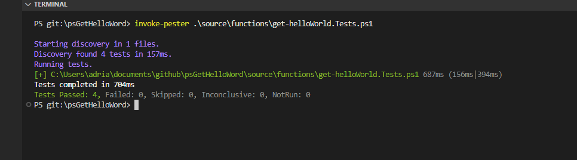

## Part 5 - Pull Request and BuildAndRelease

### Commit changes

1. Commit _just_ our functions file with the `feat` commit prefix and a relevant comment
   - Something like `feat: added get-helloWorld function`
2. Now commit the pester test file using the `test` commit prefix
    - Something like `test: added Pester testing for get-helloWorld`
3. Publish your branch back to Azure DevOps

>Hint: If you are not sure how to commit in VSCode, switch to the `Source Control` item in the left-most menu. You will need to _stage_ each file by clicking the small plus sign next the the filename. Enter the _commit_ message into the text box labelled _changes_, when ready, hit _commit_. Once all your files are committed, you can publish your branch with the `Publish Branch` button that replaces the `Commit` button

> Note: Don't forget to checkout the Main branch on your local working directory before adding any more code.


### Create a Pull request

1. In your browser, navigate to your Azure DevOps project workspace and then repository and select the _files_ Item. You should see a notification banner at the top advising that a new branch can be used to create a PR.
   - 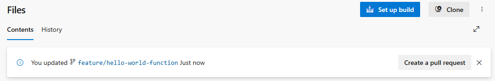
2. Click the option to create a Pull Request
3. Fill in the Pull Request template
   - Type in a decent description
   - Check the appropriate options with an `X` to help determine your next version, and to make it easier to review later.
   - 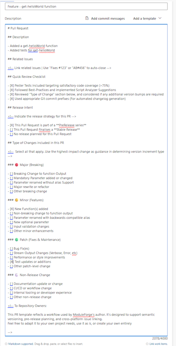
4. Once you have completed the PR template, create the Pull Request
5. On submission of a Pull Request to the Main branch, the Pester and ScriptAnalyzer workflows will automatically be invoked. The results will be added as comments to the PR
   - 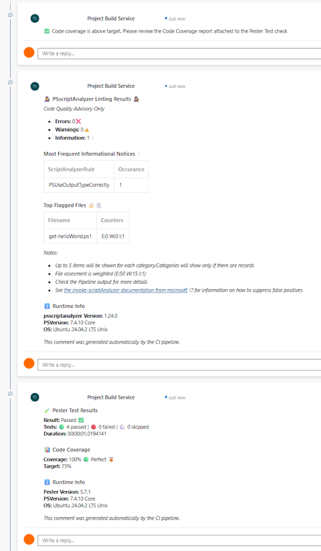
6. If everything is tracking well, our tests passed, there are no merge conflicts, and we should be ok to proceed to `Merge Pull Request`

> If you want to explore your pester results in more details before a merge, you can click on `checks` and review the pipeline results in details. You can also check out the Code-Coverage results that get added as part of the Pester Test step.

### Build and Release

1. With our Pull Request merged, navigate to `Pipelines` menu
2. Find and select the `Build and Release` pipeline associated to your repository
3. Select the `Run Pipeline` option, a menu will appear. Fill out the fields appropriately and then choose `run workflow`
   - Branch should be main
   - Since this is our first release, lets leave the type to increment as `none`
   - Type of release should be `prerelease`
   - The `ModuleForge` version should be stable
   - The feedname should match what you set in the PreRequisits
        - If you changed the feedname, recommend you also update this form to reflect that change by editing the _buildAndRelease.yml_ file
   - 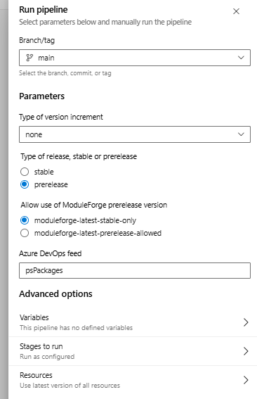
4. Wait for our pipeline to finish.
5. Browse to _Artifacts_ and your Package Feed, where you can 

>If you want to `manually` download and install your new module, you can download the nupkg from the package feed, rename the extension to `.zip` and uncompress to find your module.

## Part 6 - Install locally with PSresourceGet

In your PowerShell terminal with PSResourceGet ready to go, you can register a new repository. You will only need to register the repository once.

1. Create a Azure DevOps Personal Access Token.
    - You can find the Personal Access Tokens setting in the small `User Settings` menu next to your Profile headshot in the top right of Azure DevOps
    - The Personal Access Token only requires `Packages: Read` access
    - The Personal Access Token value will form the _password_ part of our credential object and allow us to use our Azure Devops feed.
2. In a PowerShell Terminal, register your Azure Devops feed as a repository
   - There are two ways to register
       - With a Credential Object, 
       - With a special CredentialInfo class (If you are using `Microsoft.PowerShell.SecretManagement` module). This is the recommended approach

You can read more about the next steps [here](https://learn.microsoft.com/en-us/azure/devops/artifacts/tutorials/private-powershell-library?view=azure-devops&pivots=psresourceget)

#### Using Azure DevOps Package Feed with Credentials
To register with a credential, see the example code below

```powershell
### Create a credential object
### Your username will be your Azure DevOps account email
### The password will be the PAT you created
$azdCredential = Get-Credential

#use the register-psResourceRepository commandlet to register
#This is easier to do with splatting
#Don't forget to swap out the azdCredential with your actual Azure account
$splat = @{
    Name = 'myAzureDevopsFeed'
    Uri = 'https://pkgs.dev.azure.com/<ORGANIZATION_NAME>/<PROJECT_NAME>/_packaging/<FEED_NAME>/nuget/v3/index.json'
    Trusted = $true
}
#Splat it in
Register-PSResourceRepository @splat

#Once registered, you can use it in a similar fashion to PSGallery
#Don't forget to specify the -PreRelease flag
Find-PSResource -Name psGetHelloWorld -Prerelease -Repository myAzureDevopsFeed -Credential $azdCredential

```

#### Using Azure DevOps Feed with a Secret Vault (Recommended)

To register with  `Microsoft.PowerShell.SecretManagement`, first, create a new secret in your secret vault. The username should be your Azure DevOps account email, and the password the PAT you created

```powershell
### Create a pointer to your secret and vault
### Your username will be your AZD email
### The password will be the AZD PAT you created
#You will need to make sure that PSResourceGet module is imported first
$credentialInfo = [Microsoft.PowerShell.PSResourceGet.UtilClasses.PSCredentialInfo]::new('VaultName', 'SecretName')

#use the register-psResourceRepository commandlet to register
#This is easier to do with splatting
#Don't forget to swap out the azdCredential with your actual azure account
#
$splat = @{
    Name = 'myAzureDevopsFeed'
    Uri = 'https://pkgs.dev.azure.com/<ORGANIZATION_NAME>/<PROJECT_NAME>/_packaging/<FEED_NAME>/nuget/v3/index.json'
    Trusted = $true
    CredentialInfo = $credentialInfo
}
#Splat it in
Register-PSResourceRepository @splat

#Once registered, you can use it in a similar fashion to PSGallery
#Don't forget to specify the -PreRelease flag
#Because we supplied a CredentialInfo pointer, Find-PSResource will automatically open our vault to retrieve the secret when required
Find-PSResource -Name psGetHelloWorld -Prerelease -Repository myAzureDevopsFeed

```

> A note on V3 nuget feeds and PSResourceGet. Wildcard searching is not supported at this time, you will need to know the exact name of your module for find and install commands to work.

## Wrapping up

In this tutorial, we created a new repository, added our ModuleForge scaffolding, created a new PowerShell function + test, performed a review and unit test, and released it as a PreRelease into our private Azure DevOps Packages feed for consumption. We effectively made a CI/CD PowerShell Pipeline using Azure DevOps Pipelines + ModuleForge, and published a single-function module.

