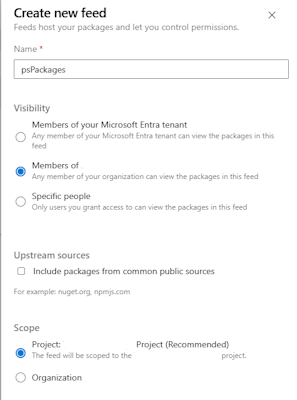
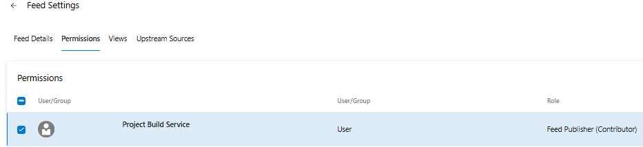
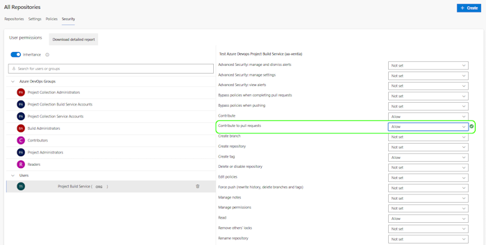

# Prerequisits before using Azure DevOps with Moduleforge

The following steps need to be completed once per Azure DevOps project. You do _NOT_ need to repeat this for each subsequent repository within an Azure DevOps project space.

## Pt 1 - Create a package feed

In order for us to _publish_ and host our private modules, we need to setup a package feed.

If you have an existing feed, you can skip this process

1. Within your Azure DevOps project, click on `Artifacts`
2. select `Create new Feed`
    - Create a name for your feed. ModuleForge will by default expect it to be `psPackages`
        - If you change the name of the default feed, you should also take care to update the Pipeline files after scaffolding.
    - Set the visibility to `Members of {projectName}`
    - You can disable _Upstream sources_
    - Set the scope to the project level

## Pt 2 - Grant Build Service Feed Permissions

This step is important to allow the Build and Release step to successfully publish artifcats to our feed

1. Click on Artifacts again
2. With your `psPackages` (or alternative name) feed selected, click on the small cog (⚙️) icon in the top right, that when hovered over states `Feed Settings`
3. Select the `Permissions` tab
4. Find and select the User/Group item that is labelled as Build Service, something like: `{ProjectName} Build Service ({OrganizationName})`
5. Select _Edit_ and add the `Feed Publisher (Contributor)` permission
6. Save the changes

## Pt 3 - Grant Build Service PR Permissions

This step allows the Build Service agent to post comments to PRs within workflows

1. Select the `⚙️ Project Settings` option in the bottom right of the Project screen
2. Select the `Repos/Repositories` menu item
3. Select the `Security` tab
4. Ensure that the top of the display states `All Repositories`.
    - If you like, you can permission this to individual repositories. Note that if you do so, you will need to follow this process for any new repositories in the future
4. Find the Build Service account. something like: `{ProjectName} Build Service ({OrganizationName})`
5. Set the _Contribute to pull requests_ permission to `Allow`

