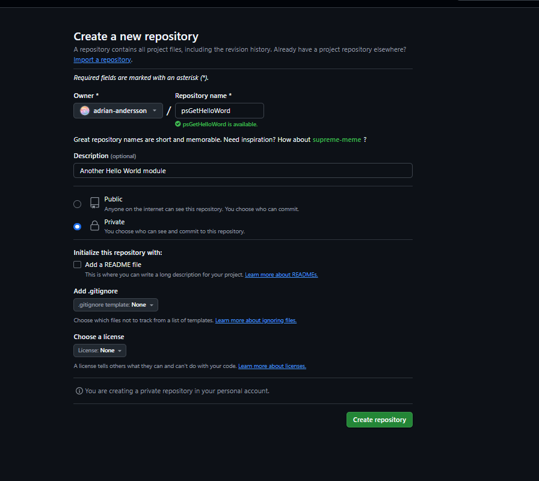
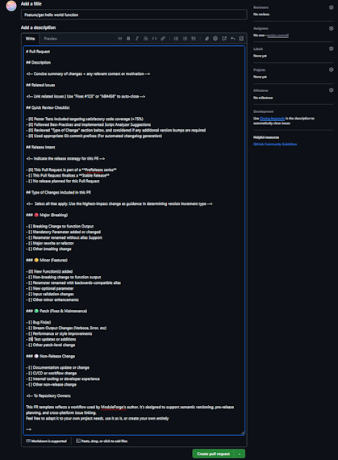
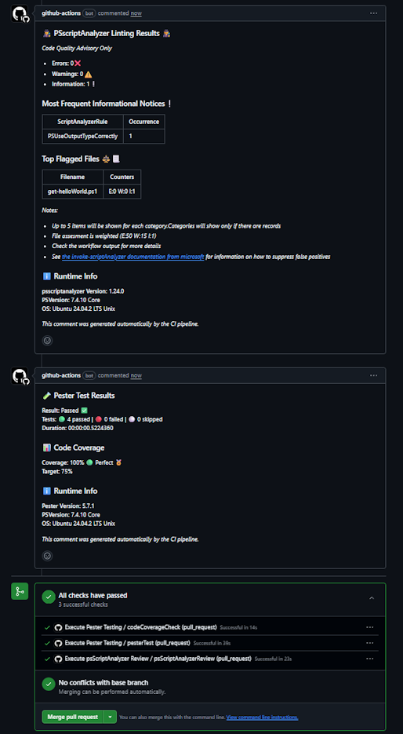
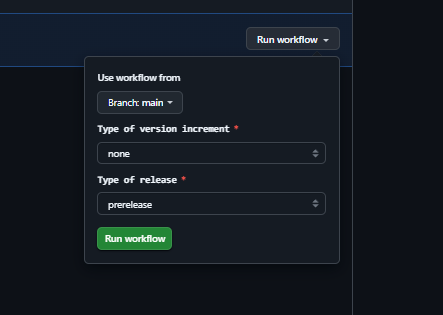
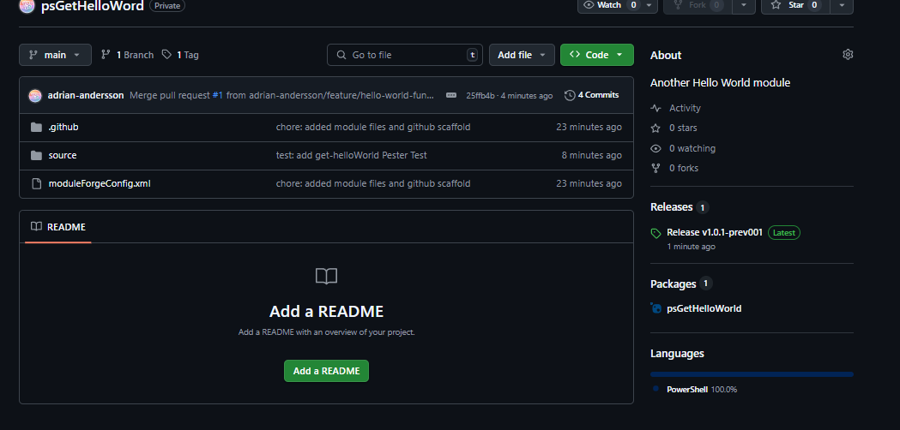
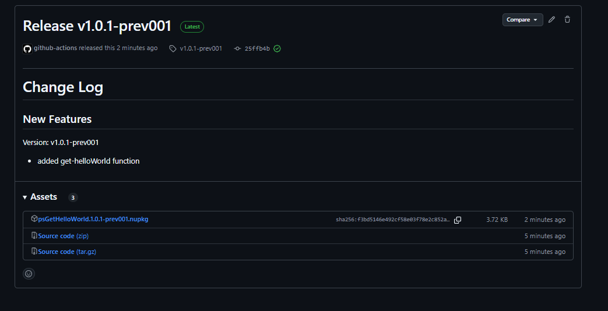

# Tutorial

This tutorial will demonstrate how to create a simple, single-function module using ModuleForge, with 1 pester test, and deploy via Github workflows.

## Part 0 - Local Environment Setup

1. Setup your local workspace. You will need to have installed
    - PowerShell 7+
    - VSCode (or your IDE of choice)
        - If you use an IDE other than VSCode, you will need to correct the instructions in this tutorial accordingly
    - GIT commandline
2. Install PowerShell module dependencies. You will need the following modules from the PSGallery:
    - `Pester` 5.6+
    - `PSScriptAnalyzer` 1.24+
    - `Microsoft.PowerShell.PSResourceGet` 1.1.1+
    - `ModuleForge` 1.2.0+

> Note: All the required modules are cross-platform compatible. You're OS of choice does not matter.

Here is a code-snippet to help get you started

```PowerShell
#Use the legacy PowerShell Get command to get PSResourceGet
Install-Module Microsoft.PowerShell.PSResourceGet

#Switch to PSResourceGet for the remainder
Install-PSResource -repository PSGallery -Name Pester,PSScriptAnalyzer,ModuleForge
```

## Part 1 - New Repository

1. Login to your github account
2. Browse to your personal repositories and select 'Create a new repository'
3. Fill in the new repository details
   - Repository Name should be 'psGetHelloWorld'
   - Repository Description should be 'Another Hello World Module'
   - Repository should be private
    
4. Clone your repository to your local environment

> hint: If you are unsure of how to clone a repository, copy the URI from the browser address bar and use it with the `git clone` command, e.g. `git clone https://github.com/adrian-andersson/ModuleForge`

## Part 2 - Create a new ModuleForge Project

1. From your repository directory, run the `New-MFProject` function to build the files out, as per the example below
2. Check you have created a `source` directory and a module config file `moduleForgeConfig.xml`. The source directory shoud have a number of subfolders
3. Run the `Add-MFGithubScaffold` function to add 2 github workflow files and a PR template to the `.github` directory of your module folder
4. Check the files were created
5. With your filestructure created and workflows added, commit and sync your repository back to origin\main
   - You should use a proper commit message, something like `chore: Initialised ModuleForge project with scaffolding & workflows'
  
```powershell
New-MFProject -ModuleName 'psGetHelloWorld' -description 'Another Hello World module'
Add-MFGithubScaffold
```

## Part 3 - Create a Function and a Test

### Creating our get-helloWorld function

1. Create a branch called `feature/hello-world-function`. You can deviate from this naming convention if you like. The objective is to be consistant.
2. Create a new file in the `functions` sub-directory of the `source` directory
   - Call the file `Get-HelloWorld.ps1`
3. Code up your powershell function code.
   - An example is provided below
   - Make sure you include some form of Inline Help and follow good coding practices

> Hint: In VSCode you can create a branch by clicking on the current branch name in the bottom left corner, then in the dialog box, selecting `+Create New Branch`. VSCode will automatically switch you to the new branch

```PowerShell
function Get-HelloWorld
{

    <#
        .SYNOPSIS
            Return Hello World
            
        .DESCRIPTION
            Return Hello World. Allows you to overwrite the default name of world with 
            
        .EXAMPLE
            Get-HelloWorld
            
            #### OUTPUT
            Returns "Hello World!"

        .EXAMPLE
            Get-HelloWorld -name 'James'
            
            #### OUTPUT
            Returns "Hello James!"
    #>

    [CmdletBinding()]
    PARAM(
        #Name param, specify to override the default of World
        [Parameter()]
        [string]$name = 'World'
    )
    begin{
        #Return the script name when running verbose, makes it tidier
        write-verbose "===========Executing $($MyInvocation.InvocationName)==========="
        #Return the sent variables when running debug
        Write-Debug "BoundParams: $($MyInvocation.BoundParameters|Out-String)"
        
    }
    
    process{
        "Hello $name!"
    }
    
}

```

### Creating our Pester Test

1. Create a new file in the `functions` sub-directory of the `source` directory
   - Call the file `Get-HelloWorld.Tests.ps1`
   - It is important that `Tests` is in the correct, capital-case format for `Invoke-Pester` to work.
2. Code up your Pester Test. You can use the example below
   - Don't forget to load your functions file in a before all block
   - This can be achieved dynamically with this little piece of code: `. $PSCommandPath.Replace('.Tests.ps1','.ps1')`

```PowerShell
BeforeAll{
    #Load The Function File
    . $PSCommandPath.Replace('.Tests.ps1','.ps1')
}

Describe "Get-HelloWorld Default Parameters" {
    BeforeAll {
        $hello = Get-HelloWorld
    }

    It 'Should not be null or empty' {
        $hello |Should -Not -BeNullOrEmpty
    }

    It 'Should contain "Hello World!"' {
        $hello |Should  -Be 'Hello World!'
    }
}

Describe "Get-HelloWorld Custom Name" {
    BeforeAll {
        $hello = Get-HelloWorld -name 'James'
    }

    It 'Should not be null or empty' {
        $hello |Should -Not -BeNullOrEmpty
    }

    It 'Should contain "Hello James!"' {
        $hello |Should  -Be 'Hello James!'
    }
}

```

### Run our Pester Test Locally

1. It is a good idea to test locally before we submit our code back to the repository
    - We can do that from our invoking pester from our working directory, as per below
    - If everything is working as intended, you should have passed the 4 tests (represented in our Pester test as 'It' blocks)

```PowerShell
Invoke-Pester '.\source\functions\Get-HelloWorld.Tests.ps1'
```


## Part 4 - Pull Request and BuildAndRelease

### Commit Changes

1. Commit _just_ our functions file with the `feat` commit prefix and a relevant comment
   - Something like `feat: added Get-HelloWorld function`
2. Now commit the pester test file using the `test` commit prefix
    - Something like `test: added Pester testing for Get-HelloWorld`
3. Publish your branch back to github

>Hint: If you are not sure how to commit in VSCode, switch to the `Source Control` item in the left-most menu. You will need to _stage_ each file by clicking the small plus sign next the the filename. Enter the _commit_ message into the text box labelled _changes_, when ready, hit _commit_. Once all your files are committed, you can publish your branch with the `Publish Branch` button that replaces the `Commit` button

### Create Pull Request

1. In your browser, navigate to your new repository. You should see a notification banner in the top of github advising that a new branch can be used to create a PR.
   - 
2. Click the option to create a Pull Request
3. Fill in the Pull Request template
   - Type in a decent description
   - Check the appropriate options with an `X` to help determine your next version, and to make it easier to review later.
   - 
4. Once you have completed the PR template, create the Pull Request
5. On submission of a Pull Request to the Main branch, the Pester and ScriptAnalyzer workflows will automatically be invoked. The results will be added as comments to the PR
   - 
6. If everything is tracking well, our tests passed, there are no merge conflicts, and we should be ok to proceed to `Merge Pull Request`

> If you want to explore your pester results in more details before a merge, you can click on `Actions`, find the `pesterTest` workflow, and expand the `Run pester tests` step from our latest run to view things such as code coverage, or get more details on failures etc.

### Build and Release

1. With our Pull Request merged, navigate to `Actions` menu
2. Find and select the `Build and Release` workflow
3. This workflow has a `workflow_dispatch` event that we can use to version, build and release our code as a PowerShell module
4. Select the `Run Workflow` option, a menu will appear. Fill out the fields appropriately and then choose `run workflow`
   - Branch should be main
   - Since this is our first release, lets leave the type to increment as `none`
   - Type of release should be `prerelease`
   - 
5. Wait for our workload to finish.
6. Navigate back to the `code` tab after the workflow completes. You should now see:
   - A new Release with a version tag and a `latest` badge
   - Packages set at 1
   - 
7. Click on the release to see more details
   - The release should have created a changelog based on our commit messages
   - There should also be some artifacts, or assets, with the important one being the nupkg file. This file contains our module. 
   -  

> Don't forget to checkout the Main branch on your local working directory before adding any more code.

>If you want to manually download and install your new module, you can download the nupkg from the releases page, rename the extension to `.zip` and uncompress to find your module.

## Part 5 - Install locally with PSresourceGet

In your PowerShell terminal with PSResourceGet ready to go, you can register a new repository. You will only need to register the repository once, as github package feeds are unique to the user or organisation, not the repository.

1. Create a Git Classic Personal Access Token.
   - It only needs Package Read access. 
   - This will form the _password_ part of our credential object and allow us to use the Github Packages feed.
2. In a PowerShell Terminal, register your github packages feed as a repository
   - There are two ways to register, 
       - With a Credential Object, 
       - With a special CredentialInfo class (If you are using `Microsoft.PowerShell.SecretManagement` module). This is the recommended approach

#### Using Github Package Feed with Credentials
To register with a credential, see the example code below

```PowerShell
### Create a credential object
### Your username will be your github email
### The password will be the github PAT you created
$githubCredential = Get-Credential

#use the Register-PSResourceRepository commandlet to register
#This is easier to do with splatting
#Don't forget to swap out the githubaccount with your actual github account
$splat = @{
    Name = 'myGithubPackages'
    Uri = 'https://nuget.pkg.github.com/{githubaccount}/index.json'
    Trusted = $true
}
#Splat it in
Register-PSResourceRepository @splat

#Once registered, you can use it in a similar fashion to PSGallery
#Don't forget to specify the -PreRelease flag
Find-PSResource -Name psGetHelloWorld -Prerelease -Repository myGithubPackages -Credential $githubCredential

```

#### Using Github Package Feed with a Secret Vault (Recommended)

To register with  `Microsoft.PowerShell.SecretManagement`, first, create a new secret in your secret vault. The username should be your github email, and the password the PAT you created

```PowerShell
### Create a pointer to your secret and vault
### Your username will be your github email
### The password will be the github PAT you created
#You will need to make sure that PSResourceGet module is imported first
$credentialInfo = [Microsoft.PowerShell.PSResourceGet.UtilClasses.PSCredentialInfo]::new('VaultName', 'SecretName')

#use the Register-PSResourceRepository commandlet to register
#This is easier to do with splatting
#Don't forget to swap out the githubaccount with your actual github account
#
$splat = @{
    Name = 'myGithubPackages'
    Uri = 'https://nuget.pkg.github.com/{githubaccount}/index.json'
    Trusted = $true
    CredentialInfo = $credentialInfo
}
#Splat it in
Register-PSResourceRepository @splat

#Once registered, you can use it in a similar fashion to PSGallery
#Don't forget to specify the -PreRelease flag
#Because we supplied a CredentialInfo pointer, Find-PSResource will automatically open our vault to retrieve the secret when required
Find-PSResource -Name psGetHelloWorld -Prerelease -Repository myGithubPackages

```

> A note on V3 nuget feeds and PSResourceGet. Wildcard searching is not supplied, you will need to know the exact name of your module for find and install commands to work.

## Wrapping up

In this tutorial, we created a new repository, added our ModuleForge scaffolding, created a new PowerShell function + test, performed a review and unit test, and released it as a PreRelease into our private Github Packages repository for consumption. We effectively made a CI/CD PowerShell Pipeline using Github Actions + ModuleForge, and published a single-function module.